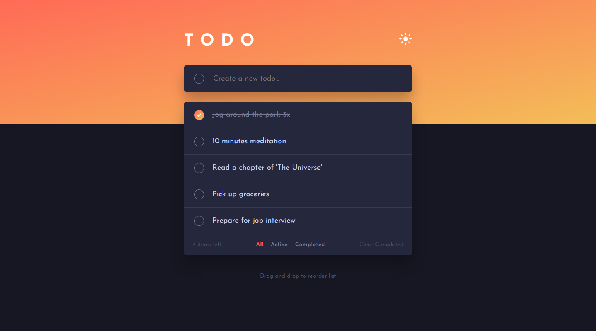
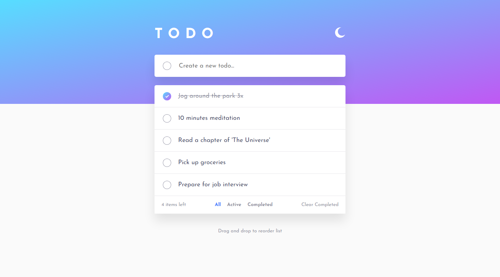
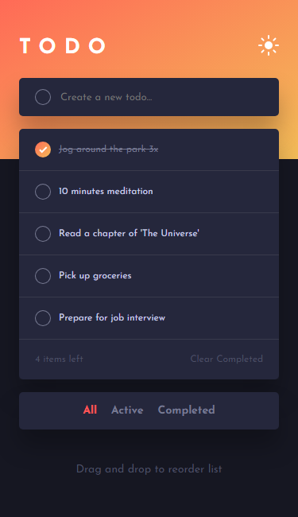
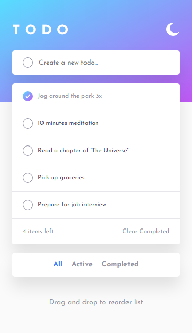

# Todo

[Link to app](https://venusy.github.io/todo/)

A simple yet useful and modern todo app built using vanilla JS, HTML, and SCSS. 
It features an edit button and a corresponding confirm edit button as an extra 
feature to facilitate the editing of existing tasks.

It utilises the browser's built in local storage to allow CRUD operations 
carried out by the user to persist between sessions as long as the user does 
not clear the local storage.

## Table of Contents

- [How to Use This App](#how-to-use-this-app)
- [Built With](#built-with)
- [Why I Built This Project](#why-i-built-this-project)
- [Preview](#preview)
  - [Desktop Preview](#desktop-preview)
  - [Mobile Preview](#mobile-preview)
- [Author](#author)

## How to Use This App

⚠️ Because this app uses the localStorage web API to handle the storage and 
persistence of tasks, if you clear your browsing data or cookies and other site 
data, it will cause your tasks to be deleted.

- Using the input field at the top of the app, you can add tasks to the list.
- Clicking the check button on the left before adding a task adds the task in 
an already completed state.
- You can toggle a task's status between 'completed' and 'active' by clicking 
the check button on the left.
- You can view all tasks, only active tasks, or only completed tasks by clicking 
on the buttons below the list.
- You can clear all completed tasks by clicking on the 'Clear Completed' button 
on the bottom right.
- To toggle the theme between light and dark mode, you can use the theme button 
on the top right.

## Built With

- Semantic HTML markup
- [Sass partials](https://sass-lang.com/documentation/at-rules/use/#partials)
- [Sass functions](https://sass-lang.com/documentation/at-rules/function/)
- [Sass mixins](https://sass-lang.com/documentation/at-rules/mixin/)
- CSS custom properties
- CSS flexbox
- Mobile-first workflow
- SVGs

## Why I Built This Project

I built this project because I wanted practice with building an app with full 
CRUD functionality, and I wanted to challenge myself by having the user-submitted 
tasks persist between sessions.

## Preview

### Desktop Preview

Dark mode  

Light mode  

### Mobile Preview

Dark mode  

Light mode  

## Author

- LinkedIn - [Venus Yip](https://www.linkedin.com/in/venus-yip-869aa4217/)
- Frontend Mentor - [@VenusY](https://www.frontendmentor.io/profile/VenusY)
